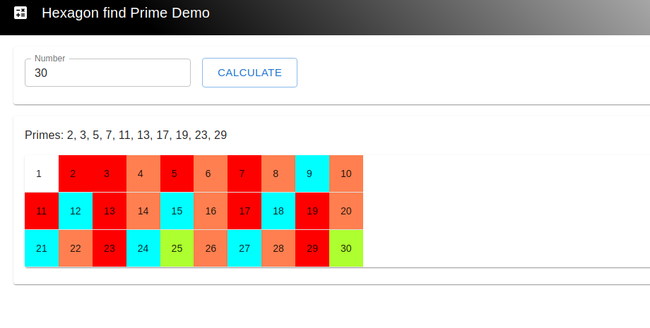

### [Navigate to Home](../README.md)

Clone repo
```
git clone git@github.com:joshualucas84/springboot-demo.git
cd springboot-demo
```

In the root directory of the project run the following command to launch
```
./gradlew bootRun
```

Application url 
### [http://localhost:8080](http://localhost:8080)



To run test root directory of the project run the following command 
```
./gradlew clean test
```

### [Navigate to Answer to Question 2](docs/Answer2.md)
